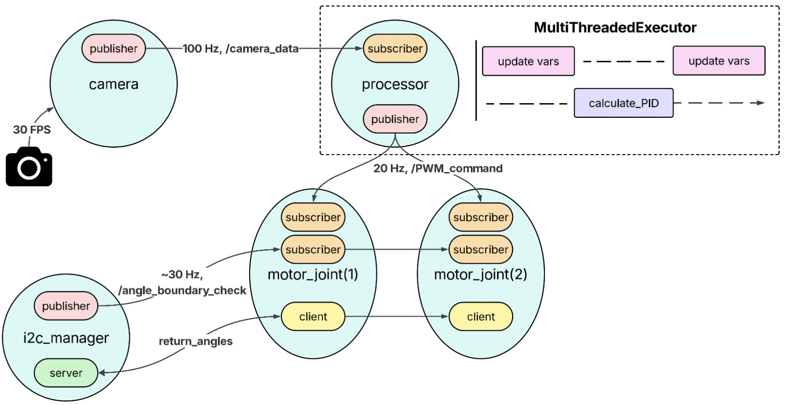

<h1>FaceTracker 26</h1>

[Download/View Video](./images/FaceTrackerFinalProduct.mp4)

### Catalog
- [Workflow](#workflow)
- [Installation](#installation)
- [Packages](#packages)
- [ROS2 Reminder](#ros2-reminder)

## Workflow
Sensor data collection (e.g., magnetic encoder, FT sensors, camera) runs independently of motor execution.

    

## Installation
- Install ROS2 (version Jazzy)
- Download this repository to a workspace (ie, a directory)
  ~~~
  git clone https://github.com/LeoTKM/FaceTracker.git
  ~~~
- Source ROS2 and run the launch files

## Packages
This project has four packages:

- **face_tracker**: data collection, arm control and simluation (RViz)
    - node: entry
    - node: camera
    - node: processor
    - node: motor_joint
    - node: i2c_manager

 
- **face_messages**: custom message types

| Types | Fields |
|------|--------|
| Boundary.msg | j1_out_of_bound: bool, j2_out_of_bound: bool |
| FaceShift.msg | delta_x, delta_y, init_done: bool |
| MotorPWM.msg | pwm_j1, pwm_j2 |
| Angles.srv | zeroed: bool, angle_j1, angle_j2 |
    
- **face_tracker_urdf**: .urdf file of the tracker model, RViz configuration and launch files. 

- **robo_arm_urdf**: open source Arctos package 
 

These packages are located in the root directory.

## ROS2 Reminder

Parallelism is impossible with a single core. People often mean concurrency, ie, switching between tasks fast enough to create the illusion that they are running at the same time (running in parallel).

By default, all callback functions in a single ROS2 node belong to the same callback group (ie, MutuallyExclusive callback group), which means that only one callback can run at a time within the node (ie, no concurrency), even when using a MultiThreadedExecutor. 

As a result, each callback (subscription, services, timer, etc.) function is assigned to a different callback group so that they can be run concurrently (or run in parallel if multiple cores are available). For simplicity, a common practice is to assign each callback its own MutuallyExclusive callback group, so that it will be the only member of that group.

However, different callbacks may now run at the same time, and thread safety is no longer guaranteed. Therefore, we will use the Threading library available in Python to ensure thread safety.
